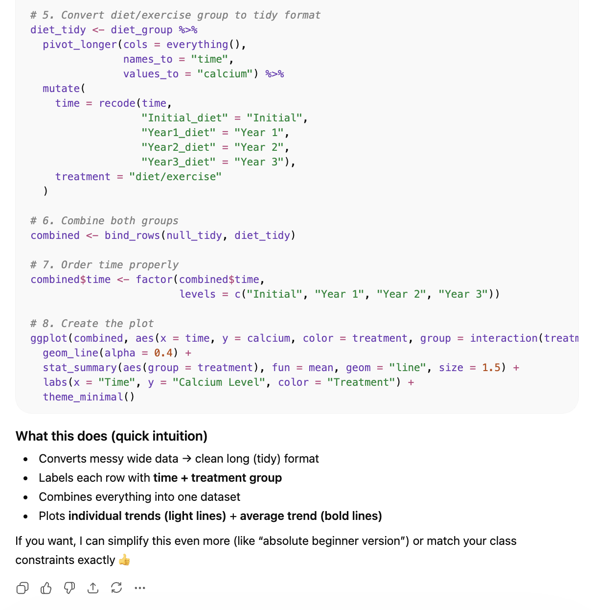
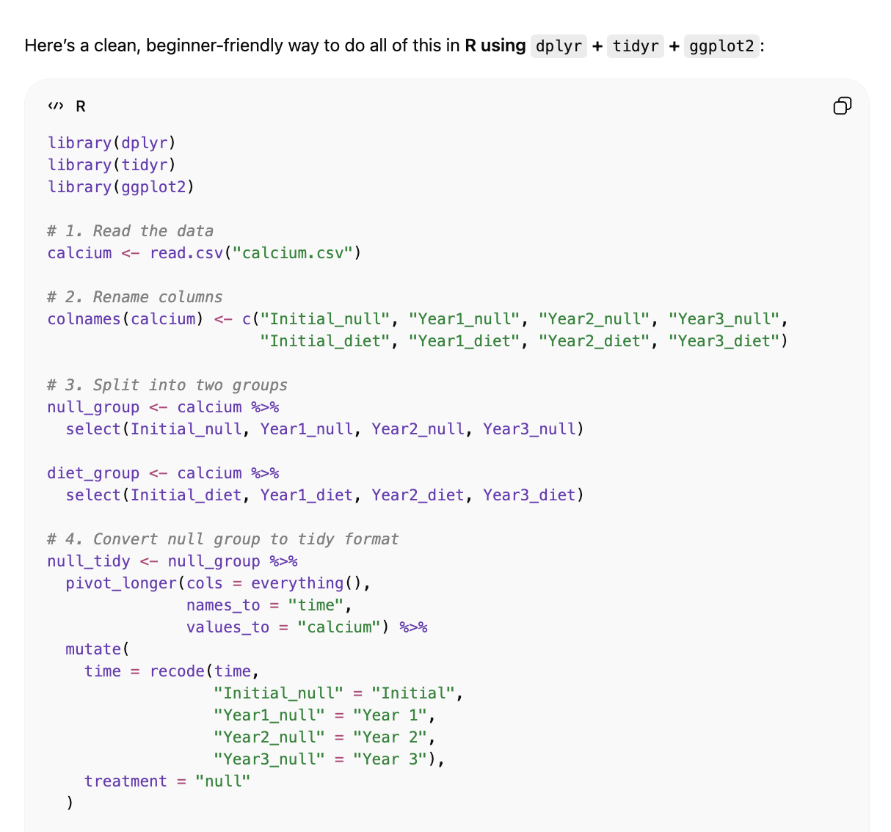
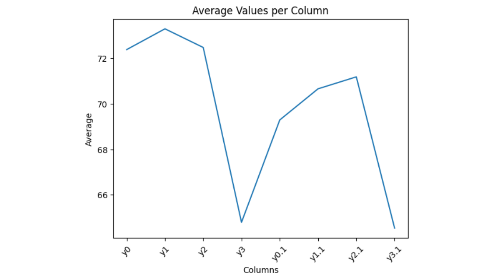



# 1. Busiest Airports

## 1.1 Busiest Airports: Table

```{r}
#| label: tbl-busiestAirportsTable
#| tbl-pos: "H"
#| tbl-width: 5
#| tbl-cap: "Busiest Airports Table"
#| echo: false
#| message: false
#| warning: false

library(dplyr)
library(tidyr)
library(knitr)

atl <- data.frame(
  airport = "Hartsfield-Jackson Atlanta International Airport",
  code = "ATL",
  year = c(2020, 2021, 2022, 2023, 2024, 2025),
  passengers = c(42700000, 75200000, 93700000, 104000000, 108000000, 110000000)
)
fra <- data.frame(
  airport = "Frankfurt Airport",
  code = "FRA",
  year = c(2020, 2021, 2022, 2023, 2024, 2025),
  passengers = c(18600000, 24800000, 48600000, 59500000, 61000000, 63000000)
)
pkx <- data.frame(
  airport = "Beijing Daxing International Airport",
  code = "PKX",
  year = c(2020, 2021, 2022, 2023, 2024, 2025),
  passengers = c(16000000, 25000000, 52000000, 58000000, 60000000, 62000000)
)
dxb <- data.frame(
  airport = "Dubai International Airport",
  code = "DXB",
  year = c(2020, 2021, 2022, 2023, 2024, 2025),
  passengers = c(25900000, 29200000, 66100000, 87000000, 90000000, 92000000)
)
hnd <- data.frame(
  airport = "Tokyo Haneda Airport",
  code = "HND",
  year = c(2020, 2021, 2022, 2023, 2024, 2025),
  passengers = c(30900000, 56000000, 66000000, 78000000, 80000000, 82000000)
)
dfw <- data.frame(
  airport = "Dallas Fort Worth International Airport",
  code = "DFW",
  year = c(2020, 2021, 2022, 2023, 2024, 2025),
  passengers = c(39000000, 62000000, 73000000, 81000000, 83000000, 85000000)
)
airports_clean <- bind_rows(atl, fra, pkx, dxb, hnd, dfw)

airports_table <- airports_clean |>
  select(code, year, passengers) |>
  pivot_wider(
    names_from = year,
    values_from = passengers
    )

kable(airports_table)
```

### Table Alt Text

A table of busiest airport passenger numbers from 2020 to 2025 for six major airports (ATL, DFW, DXB, FRA, HND, and PKX).

### Table Long Description

@tbl-busiestAirportsTable is a table listing the "Busiest Airports" with passenger counts in millions across different years from 2020 to 2025. The table includes six airport codes: ATL, FRA, PKX, DXB, HND, and DFW. Each row corresponds to an airport and presents passenger numbers for each year. The data is formatted in standard and scientific notation. The header row labels are "code", followed by annual columns from 2020 to 2025.

## 1.2 Busiest Airports: Plot/Graph

```{r}
#| label: fig-busiestAirportsPlot
#| fig-pos: "H"
#| fig-width: 5
#| fig-cap: "Busiest Airports Plot/Graph"
#| echo: false
#| message: false
#| warning: false

library(ggplot2)
airports_clean |>
  ggplot(aes(x = year, y = passengers, color = code)) +
  geom_line() +
  geom_point() +
  scale_color_manual(values = c("ATL" = "darkmagenta", "DFW" = "orchid",
                                "DXB" = "violetred", "FRA" = "deeppink",
                                "HND" = "hotpink", "PKX" = "pink")) +
  theme_classic(base_family = "serif") + labs(x = "Year",
                                              y = "Passengers",
                                              color = "Airport Code")
```

### Plot/Graph Alt Text

A line graph showing the number of passengers at six major airports (ATL, DFW, DXB, FRA, HND, and PKX) from 2020 to 2025.

### Plot/Graph Long Description

@fig-busiestAirportsPlot is a line graph that displays passenger traffic for six major airports (ATL, DFW, DXB, FRA, HND, and PKX) from 2020 to 2025. The x-axis represents the years, and the y-axis shows the number of passengers. Each airport is represented by a different colored line. Overall, all airports show an upward trend in passenger traffic over time, indicating recovery and growth after 2020. ATL consistently has the highest passenger numbers across all years, followed by DXB and DFW. HND and FRA show steady growth, while PKX starts with lower passenger counts but increases over time. The lines generally rise from left to right, showing increasing traffic at all airports.

## 1.3 Busiest Airports: Narrative Text

Looking at both the table in @tbl-busiestAirportsTable and the graph in @fig-busiestAirportsPlot, we can see that passenger traffic goes up a lot from 2020 to 2025 for all airports. This makes sense since travel was low in 2020 and then started recovering due to COVID. ATL is the busiest every year, and DXB and DFW also grow a lot. The table shows the exact numbers, while the graph makes it easier to see the trends over time.

# 2. Monte Carlo Numeric Integration

## 2.1 Monte Carlo Numeric Integration: Plot/Graph

```{r}
#| label: fig-monteCarloPlot
#| fig-pos: "H"
#| fig-width: 12
#| fig-height: 8
#| fig-cap: "Monte Carlo Numeric Integration Plot/Graph"
#| echo: false
#| message: false
#| warning: false

library(ggplot2)
library(patchwork)

monte_carlo_points <- function(n, xmin, xmax, ymin, ymax) {
  x <- runif(n, xmin, xmax)
  y <- runif(n, ymin, ymax)
  data.frame(x = x, y = y)
}

make_plot <- function(n) {
  df <- monte_carlo_points(n, 0, 1, 0, 1.5)
  df$f <- dbeta(df$x, shape1 = 2, shape2 = 2)
  df$type <- ifelse(df$y <= df$f, "on or below", "above")
  area <- 1 * 1.5
  estimate <- area * (sum(df$type == "on or below") / n)
  ggplot(df, aes(x, y, color = type)) +
    geom_point() +
    stat_function(
      fun = dbeta,
      args = list(shape1 = 2, shape2 = 2),
      xlim = c(0, 1)
   ) +
    scale_color_manual(values = c("on or below" = "pink",
                                  "above" = "hotpink"
    )) +
    labs(
      title = paste("n =", n),
      subtitle = paste("Estimate =", round(estimate, 4)),
      x = "x",
      y = "y",
      type = "Point Type"
      )
}

plot10 <- make_plot(10)
plot100 <- make_plot(100)
plot1000 <- make_plot(1000)
plot10000 <- make_plot(10000)

plot10 + plot100 + plot1000 + plot10000
```

### Plot/Graph Alt Text

Four scatter plots of Monte Carlo Numeric Integration with points n=10, n=100, n=1000, n=10000.

### Plot/Graph Long Description

@fig-monteCarloPlot shows four scatter plots illustrating Monte Carlo Numeric Integration with varying numbers of points: 10, 100, 1000, and 10000. Each plot features a parabolic curve, y = 1.5 - 6x + 6x\^2, overlaid on a grid. Randomly distributed points in two shades of pink signify types: "above" and "on or below" the curve. The top left plot (n = 10, Estimate = 1.05) shows sparse points. The top right plot (n = 100, Estimate = 0.975) has more points, showing a clearer distribution around the curve. The bottom left plot (n = 1000, Estimate = 0.9915) features dense points, further delineating the curve. The bottom right plot (n = 10000, Estimate = 0.9899) is densely packed with points forming a pronounced distribution. Each plot includes a legend: dark pink for "above" and light pink for "on or below."

## 2.2 Monte Carlo Numeric Integration: Narrative Text

As the number of points increases, the estimate gets closer to the true value. When n = 10, the estimate is not very accurate, but as we go to n = 1000 and n = 10000, the values get really close to 1. This shows that using more points makes the Monte Carlo method more accurate. The exact value of the integral is 1 because it is a Beta(2,2) probability density function. The last two plots support this since their estimates are very close to 1.

# 3. Planning and Prompting

## 3.1 Planning and Prompting: Plan Informed-Response

### Plan

**Goals**

-   Turn the calcium data into a tidy format

-   Combine both treatment groups into one dataset

-   Track calcium levels over time from Initial to Year 3

-   Compare the null group and the diet/exercise group

-   Create a plot to show how calcium changes over time for both groups

**Nouns and Verbs**

Nouns: data frame, treatment group, calcium level, plot

Verbs: load, reshape, rename, combine, label, group, organize, plot, compare

**Steps**

1.  Rename columns to Initial, Year 1, Year 2, Year 3 for both groups.
2.  Split the dataset into two parts: null group and diet/exercise group.
3.  Convert each group from wide format to tidy format.
4.  Create a column called time with values Initial, Year 1, Year 2, Year 3.
5.  Create a column called calcium that stores the measurement values.
6.  Add a column called treatment that labels rows as null or diet/exercise.
7.  Combine both groups into one single dataframe.
8.  Make sure the time column is ordered from Initial to Year 3.
9.  Create a plot with time on the x-axis and calcium on the y-axis.
10. Use color to distinguish treatment groups.
11. Add lines to show how calcium changes over time.
12. Compare how the trends differ between the two groups.

### Response

Prompt: Copy from plan above





Prompt: What is your version information?

Right now you’re using:

-   Model: GPT-5.3

-   Provider: OpenAI

-   Knowledge cutoff: August 2025

If you need to write it for an assignment, you can say something like:

“ChatGPT (GPT-5.3, OpenAI, knowledge cutoff August 2025)”

## 3.2 Planning and Prompting: Generic Response

Prompt: Create a data visualization for these data. Calcium.csv



I created a visualization showing the average value of each column in your dataset.

What this shows:

-   Each point represents the mean (average) of one column (y0, y1, y2, y3, etc.).

-   You can quickly compare which variables tend to have higher or lower values overall.

-   For example, some columns cluster around \~70–73, while others drop closer to \~65.

If you want something more insightful, I can also create:

-   Boxplots (to show spread and outliers)

-   Time series plots (if rows represent time/order)

-   Correlation heatmaps

-   Side-by-side comparisons (e.g., y0 vs y0.1)

Just tell me 👍

Prompt: What is your version information?

You’re chatting with ChatGPT based on the GPT-5.3 architecture.

Key details:

-   Model: GPT-5.3

-   Knowledge cutoff: August 2025

-   Current date (system): March 31, 2026

If you need more technical details (capabilities, differences vs GPT-4/5, etc.), just let me know 👍

(This chat took place on Tuesday, March 31st, 2026.)

## 3.3 Planning and Prompting: Narrative Text

The generic GenAI response only created a basic visualization by taking the average of each column, which does not reflect how the data is actually structured. It treated each column separately and ignored the fact that the dataset represents a study with two different treatment groups over time. Because of this, the plot does not show any trends or meaningful comparisons. In contrast, the plan-informed response correctly reshaped the data into a tidy format, created variables for time and treatment group, and produced a plot that shows how calcium levels change over time for both groups. This makes it much easier to understand the effect of the diet and exercise program compared to the null group. This comparison shows that when prompts are more specific and structured, GenAI produces more useful and accurate results, while vague prompts lead to oversimplified outputs that miss important context.

# 4. Self-Reflection

Throughout this course, I have learned how to approach data analysis in a more structured and thoughtful way. At the beginning, I often focused on just getting code to run without fully understanding each step. Over time, I started planning my approach more carefully and checking my results, which helped me improve both my understanding and the quality of my work.

One example of this growth is from working with the Galton family dataset, where I focused on data wrangling. I learned how to clean and organize the data by selecting relevant variables, renaming columns, and making sure everything was in a usable format. I also practiced filtering and restructuring the dataset to focus on specific relationships, like parent and child heights. This helped me understand how important it is to prepare data correctly before doing any analysis, since even small issues in the structure can affect the results.

Another example is from working with the diamonds dataset, where I focused on data visualization. I created scatter plots to explore relationships between variables like price and carat. At first, my graphs were very basic, but I started to notice problems like overplotting, where too many points overlap and make patterns hard to see. I learned how to adjust the plot to make trends clearer and easier to interpret. This helped me better understand how price generally increases with carat and how visualizations can be used to show patterns in the data.

These two projects helped me understand the full process of working with data. The Galton dataset showed me how important it is to clean and structure data properly, while the diamonds dataset helped me learn how to clearly present and interpret results.

Overall, I have become more confident in both my data wrangling and visualization skills in R. I now focus more on understanding why I am doing each step and making sure my results make sense, instead of just trying to get the correct output.



# GenAI Usage Appendix
## Tool Information

Tool used: Arizona State University Image Accessibility Generator

Website: https://teachonline.asu.edu/image-accessibility-generator/

Date of use: April 2026

## Busiest Airports Table Alt Text and Long Description Generation

**Prompt:** Image upload of my Busiest Airports Table

Using the provided image, create a description and alt-text. The image description should be objective, concise, and descriptive. Descriptions should be straight forward and factual, avoiding interpretations. Begin with a general overview of what the image portrays before providing details. Not everything needs to be described if it is not contextually important. Descriptions should utilize vivid terminology to describe various features like composition, shapes, size, texture, and color. Avoid using picture of, image of, and photo of unless needed in the context of an illustration or painting type graphic. The image alt-text should be concise. A short phrase or at most a couple of sentences Should the image or graphic contain text, add a section and transcribe all the text presented.

**Response:** Long Description: The image shows a table listing the "Busiest Airports" with passenger counts in millions across different years from 2020 to 2025. The table includes six airport codes: ATL, FRA, PKX, DXB, HND, and DFW. Each row corresponds to an airport and presents passenger numbers for each year. The data is formatted in standard and scientific notation. The header row labels are "code", followed by annual columns from 2020 to 2025.

Alt-text: Table of busiest airport passenger numbers from 2020 to 2025 for six major airports (ATL, DFW, DXB, FRA, HND, and PKX).


## Busiest Airports Plot/Graph Alt Text and Long Description Generation

**Prompt:** Image upload of my Busiest Airports Plot/Graph

Using the provided image, create a description and alt-text. The image description should be objective, concise, and descriptive. Descriptions should be straight forward and factual, avoiding interpretations. Begin with a general overview of what the image portrays before providing details. Not everything needs to be described if it is not contextually important. Descriptions should utilize vivid terminology to describe various features like composition, shapes, size, texture, and color. Avoid using picture of, image of, and photo of unless needed in the context of an illustration or painting type graphic. The image alt-text should be concise. A short phrase or at most a couple of sentences Should the image or graphic contain text, add a section and transcribe all the text presented.

**Response:** Long Description: The image shows a line graph that displays passenger traffic for six major airports (ATL, DFW, DXB, FRA, HND, and PKX) from 2020 to 2025. The x-axis represents the years, and the y-axis shows the number of passengers. Each airport is represented by a different colored line. Overall, all airports show an upward trend in passenger traffic over time, indicating recovery and growth after 2020. ATL consistently has the highest passenger numbers across all years, followed by DXB and DFW. HND and FRA show steady growth, while PKX starts with lower passenger counts but increases over time. The lines generally rise from left to right, showing increasing traffic at all airports.

Alt-text: Line graph showing the number of passengers at six major airports (ATL, DFW, DXB, FRA, HND, and PKX) from 2020 to 2025.


## Monte Carlo Numeric Integration Alt Text and Long Description Generation

**Prompt:** Image upload of my Monte Carlo Numeric Integration Plot/Graph

Using the provided image, create a description and alt-text. The image description should be objective, concise, and descriptive. Descriptions should be straight forward and factual, avoiding interpretations. Begin with a general overview of what the image portrays before providing details. Not everything needs to be described if it is not contextually important. Descriptions should utilize vivid terminology to describe various features like composition, shapes, size, texture, and color. Avoid using picture of, image of, and photo of unless needed in the context of an illustration or painting type graphic. The image alt-text should be concise. A short phrase or at most a couple of sentences Should the image or graphic contain text, add a section and transcribe all the text presented.

**Response:** Long Description: The image consists of four scatter plots arranged in a 2x2 grid, showcasing Monte Carlo numeric integration. Each plot displays a parabolic function with points scattered around it, illustrating samples classified as either "above" or "on or below" the parabola. The top-left plot shows the least dense distribution with n = 10 and an estimate of 0.9. The top-right plot, with n = 100 and an estimate of 1.035, is slightly denser. The bottom-left plot with n = 1000 and an estimate of 1.014 shows a further increase in point density, particularly around the parabola. The bottom-right plot with n = 10000 and an estimate of 0.9963 presents the highest density of points, forming a pink region around the parabola. Each plot includes a legend indicating pink as "above" and light pink as "on or below."

Alt-text: Four scatter plots showing Monte Carlo integration with increasing densities n = 10, 100, 1000, 10000.

# Code Appendix

```{r codeAppend, ref.label=knitr::all_labels(), echo=TRUE, eval=FALSE}
```
